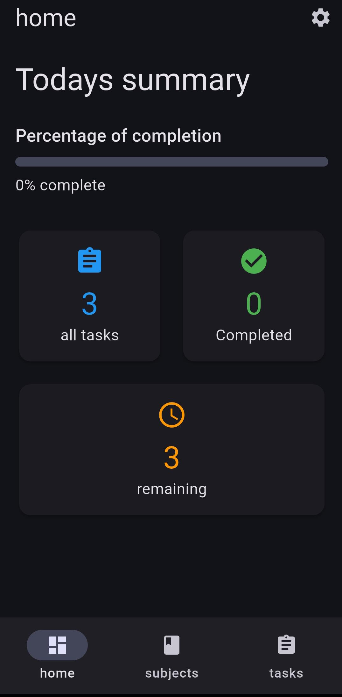
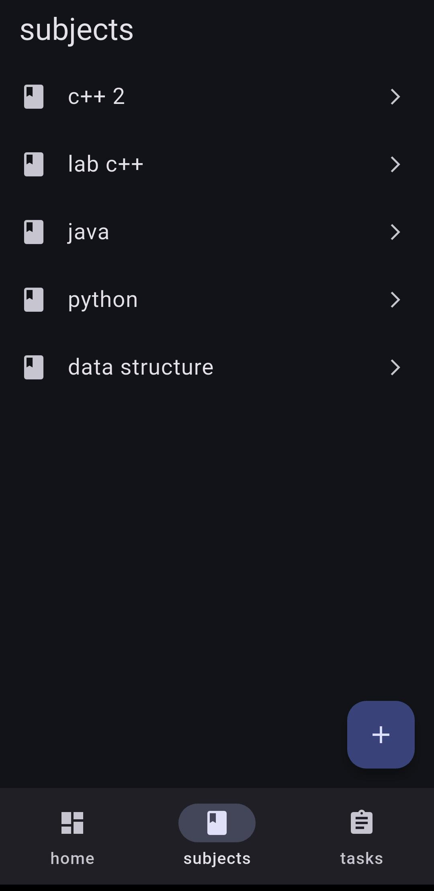
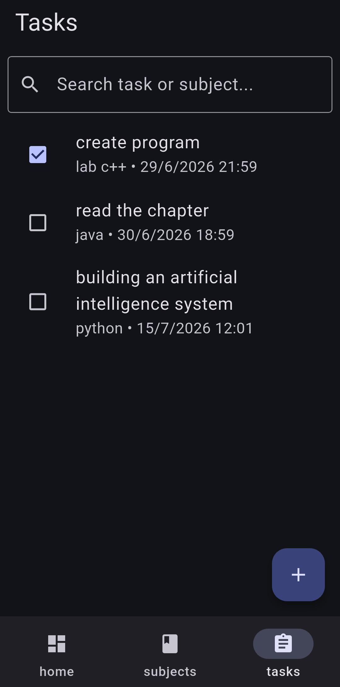
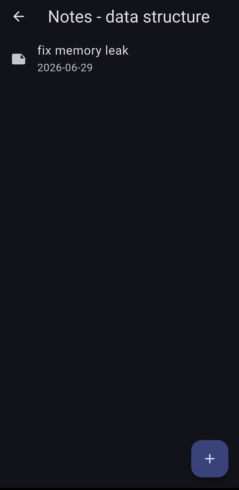

# 🎓 Student Life Manager

<div align="center">

### Organize your academic life in one place.

*A modern offline-first Flutter application that helps students manage subjects, assignments, and notes with a clean and intuitive interface.*


</div>

---

# 📖 About

Student Life Manager is an offline-first Flutter application that helps students organize their academic life by managing subjects, assignments, and notes in one place.

The application is lightweight, fast, and stores all data locally using SQLite, making it available without an internet connection.

---

# ✨ Features

* 📊 Dashboard with task statistics
* 📚 Subject Management
* ✅ Assignment & Task Tracking
* 📝 Subject Notes
* 🌙 Dark Mode
* 💾 SQLite Local Storage
* 🔍 Task Search
* 📱 Material Design 3
* 🌍 Cross Platform Support

---

# 🛠 Tech Stack

| Technology    | Description              |
| ------------- | ------------------------ |
| Flutter       | Cross-platform Framework |
| Dart          | Programming Language     |
| SQLite        | Local Database           |
| sqflite       | Database Package         |
| Material 3    | UI Design                |
| FutureBuilder | Async UI                 |
| ValueNotifier | Theme Switching          |

---

# 📱 Supported Platforms

* ✅ Android
* ✅ iOS
* ✅ Web
* ✅ Windows
* ✅ macOS
* ✅ Linux

---

# 📸 Screenshots

## Dashboard

<p align="center">

</p>

---

## Subjects

<p align="center">

</p>

---

## Tasks

<p align="center">

</p>

---

## Notes

<p align="center">

</p>

---

# 📂 Project Structure

```text
lib/
│
├── core/
│   ├── data/
│   ├── settings/
│   └── theme/
│
├── features/
│   ├── dashboard/
│   ├── settings/
│   ├── subjects/
│   └── tasks/
│
├── notes/
│
├── home_screen.dart
└── main.dart
```

---

# ⚙️ Installation

Clone the repository

```bash
git clone https://github.com/hussein-almasri/student_life_manager.git
```

Open the project

```bash
cd student_life_manager
```

Install dependencies

```bash
flutter pub get
```

Run the application

```bash
flutter run
```

---

# 🚀 Build

```bash
flutter build apk
flutter build appbundle
flutter build web
flutter build windows
flutter build linux
flutter build macos
```

---

# 📖 Usage

1. Create your academic subjects.
2. Add assignments and deadlines.
3. Track completed tasks.
4. Write notes for every subject.
5. Stay organized with the dashboard.

---

# 🏛 Architecture

The project follows a **Feature-First Architecture** with a shared **Core Layer**.

```
Presentation
      │
      ▼
Business Logic
      │
      ▼
SQLite Database
```

---

# 💾 Local Storage

All data is stored locally using SQLite.

* Subjects
* Tasks
* Notes
* Settings

No internet connection is required.

---

# 🚀 Future Improvements

* 🔔 Local Notifications
* 📅 Calendar View
* 🌍 Multi-language Support
* ☁️ Cloud Backup
* ⭐ Task Priority
* 📤 Export & Import Data

---

# 👨‍💻 Author

**Hussein Almasri**

GitHub:
https://github.com/hussein-almasri

---

# 📄 License

This project is licensed under the MIT License.

---

<div align="center">

### ⭐ If you like this project, don't forget to leave a star!

Made with ❤️ using Flutter.

</div>
